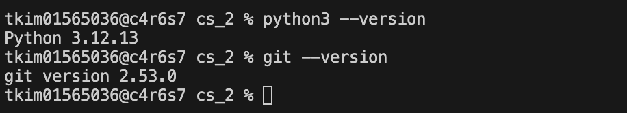
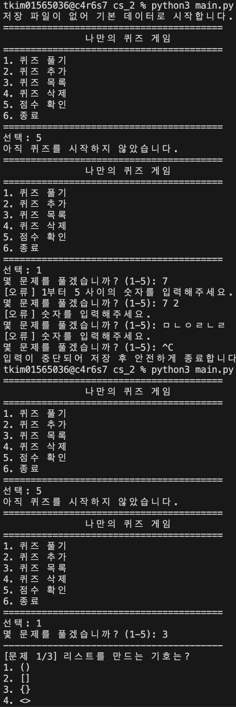
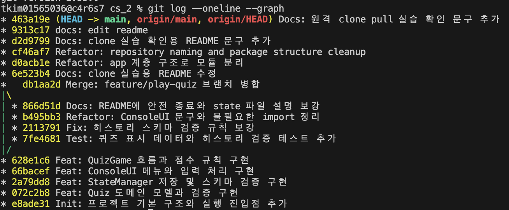

# Mission 2 Quiz Game

Python 콘솔 환경에서 동작하는 퀴즈 게임입니다. 객체지향 구조와 JSON 기반 데이터 영속성을 함께 연습하는 것이 목표입니다.

## 프로젝트 개요

- 콘솔 메뉴를 통해 퀴즈 풀기, 추가, 목록 조회, 삭제, 점수 확인을 수행합니다.
- 프로그램을 다시 실행해도 퀴즈와 최고 점수, 플레이 히스토리가 유지됩니다.
- 퀴즈 진행 중 `Ctrl+C` 또는 입력 종료가 발생해도, 이미 답한 문제까지의 결과는 가능한 범위에서 저장 후 안전하게 종료합니다.

## 제출 증빙

GitHub 저장소 URL은 `https://github.com/zxcv718/cs_2` 입니다. 이 저장소는 `git rev-list --count HEAD`에서 확인되는 커밋 수 기준으로 최소 10개 이상의 의미 있는 커밋 조건을 충족하며, `git log --oneline --graph`에서 `feature/play-quiz` 브랜치 병합 기록도 확인할 수 있습니다. 제출 시 함께 첨부한 스크린샷 파일은 `env.png`(개발 환경), `result.png`(프로그램 실행 결과), `gitlog.png`(Git 로그)입니다.







실제 실행으로 메뉴 입력 검증이 동작하는지도 확인했습니다. 아래 예시는 프로그램 시작 직후 빈 입력, 문자 입력, 범위 밖 숫자를 넣었을 때 각각 오류 메시지를 출력하고 다시 입력받는 로그입니다.

```text
========================================
               나만의 퀴즈 게임
========================================
1. 퀴즈 풀기
2. 퀴즈 추가
3. 퀴즈 목록
4. 퀴즈 삭제
5. 점수 확인
6. 종료
========================================
선택: [오류] 빈 입력은 허용되지 않습니다.
선택: [오류] 숫자를 입력해주세요.
선택: [오류] 1부터 6 사이의 숫자를 입력해주세요.
선택: 프로그램을 종료합니다.
```

퀴즈 목록과 점수 확인 기능도 실제 실행으로 점검했습니다. 현재 기본 퀴즈 5개가 목록에 출력되고, 최고 점수 26점이 저장되어 다시 확인되는 상태입니다.

```text
퀴즈 목록
1. Python의 창시자는?
2. 리스트를 만드는 기호는?
3. 함수를 정의할 때 사용하는 키워드는?
4. 조건 분기에서 사용할 수 있는 키워드는?
5. 반복문에서 즉시 탈출할 때 주로 사용하는 키워드는?

최고 점수: 26점
```

기본 퀴즈 수는 코드에서 바로 확인할 수 있으며, `DEFAULT_QUIZ_DATA`의 길이는 5입니다.

```text
$ python3 - <<'PY'
import app.config.constants as c
print(len(c.DEFAULT_QUIZ_DATA))
PY
5
```

데이터 유지도 실제로 확인했습니다. 검증 과정에서는 퀴즈를 하나 추가한 뒤 종료했을 때 `state.json` 안에 바로 저장되는지 확인했고, 퀴즈를 푸는 도중 `Ctrl+C` 또는 입력 종료가 발생한 경우에도 이미 답한 문제 기준으로 최고 점수와 히스토리가 반영되도록 동작을 보강했습니다. 현재 저장소의 `state.json`은 검증 후 원래 상태로 되돌려 두었지만, 이 방식으로 프로그램 종료 후 재실행해도 추가한 퀴즈, 최고 점수, 플레이 기록이 유지됩니다.

```text
$ rg -n "저장 확인용 문제|best_score|played_at" state.json
59:      "question": "저장 확인용 문제",
69:  "best_score": 26,
72:      "played_at": "2026-04-03T19:11:39",
```

버전 관리 실습도 실제 기록으로 확인할 수 있습니다. `git log --oneline --graph`에는 `db1aa2d Merge: feature/play-quiz 브랜치 병합`이 남아 있고, `git reflog`에는 `clone`과 `pull origin main` 기록이 남아 있습니다.

## 과제 목표 설명

이 과제를 통해 변수는 값을 이름으로 저장해 필요할 때 다시 사용하기 위한 도구라는 점을 직접 확인할 수 있었습니다. 프로그램에서는 사용자 선택, 최고 점수, 힌트 사용 수 같은 값을 변수로 관리했고, `int`, `str`, `bool`, `list`, `dict`를 각각 점수, 문제와 안내 문구, 예/아니오 판단, 선택지 목록, 저장 데이터 구조에 맞게 구분해 사용했습니다. 메뉴 선택과 정답 판정에는 `if/elif/else`를 사용해 조건에 따라 다른 동작을 수행했고, 반복 입력 처리에는 `while`, 퀴즈 목록과 문제 출제에는 `for`를 사용해 반복문의 차이도 코드로 확인할 수 있었습니다. 또 기능을 메서드 단위로 나누면서 매개변수와 반환값을 활용해 입력 처리, 게임 진행, 점수 계산 같은 동작을 분리했습니다.

클래스와 객체의 개념도 퀴즈 게임 구조 안에서 자연스럽게 적용했습니다. 최근 리팩토링에서는 단일 책임 원칙을 더 잘 맞추기 위해 `Quiz`, `QuizGame`, `QuizSessionService`의 책임을 다시 나누었습니다. `Quiz`는 이제 문제 한 개의 도메인 동작만 표현하고, 입력 검증과 정규화는 `QuizFactory`와 `quiz_components` 값 객체들이 담당합니다. `QuizGame`은 메인 루프를 돌며 서비스를 조율하는 진입점만 맡고, 런타임 상태 변경은 `GameRuntimeState`의 `restore()`와 `record_play_result()` 같은 의미 있는 메서드로 처리합니다. 또 실제 퀴즈 진행도 더 잘게 나누어, 문제 수 선택과 랜덤 출제는 `QuizSelectionService`, 한 문제 안의 힌트/정답 상호작용은 `QuizQuestionRoundService`, 중단 시 부분 결과 생성은 `QuizPartialResultBuilder`, 세션 결과 모델과 중단 예외는 `quiz_session_models`가 담당하도록 분리했습니다. 이때 `__init__` 메서드는 객체가 처음 만들어질 때 필요한 협력 객체를 준비하는 데 사용했고, `self`는 각 객체 자신의 속성과 메서드에 접근하기 위해 사용했습니다. 이렇게 속성은 데이터 보관, 메서드는 동작 수행이라는 역할로 나누어 객체지향 구조를 구성했습니다.

파일 입출력 측면에서는 프로젝트 루트의 `state.json` 파일을 읽고 쓰면서 프로그램 상태를 저장했습니다. JSON은 사람이 읽기 쉽고 Python의 `dict`, `list` 구조와 잘 맞기 때문에 퀴즈 목록, 최고 점수, 플레이 기록을 저장하기에 적합했습니다. 프로그램을 다시 실행해도 데이터가 유지되도록 저장 기능을 구현했고, 파일이 없거나 내용이 손상된 경우에는 `GameBootstrapService`가 예외를 구분해 처리한 뒤 `DefaultGameStateFactory`로 기본 상태를 복구하도록 만들었습니다. 실제 파일 읽기/쓰기는 `StateRepository`, 저장 형식 검증과 객체 복원은 `StatePayloadMapper`와 `QuizPayloadMapper`, 메모리 상태 저장 위임은 `GamePersistenceService`가 담당하도록 나누어 파일 처리 흐름도 더 명확하게 정리했습니다.

Git도 단순히 명령어를 따라 치는 것이 아니라, 왜 필요한지와 각 명령이 어떤 역할을 하는지 연결해서 이해할 수 있었습니다. Git은 코드 변경 이력을 기록하고, 이전 상태를 추적하고, 협업 흐름을 관리하기 위한 도구입니다. `init`은 저장소를 시작할 때, `add`는 변경 파일을 커밋 대상으로 올릴 때, `commit`은 작업 내용을 기록할 때 사용합니다. `push`와 `pull`은 로컬과 원격 저장소를 동기화할 때 사용하고, `checkout`은 브랜치를 이동하거나 작업 위치를 바꿀 때, `clone`은 원격 저장소를 다른 경로에 그대로 복제할 때 사용합니다. 이번 과제에서는 실제로 브랜치를 생성하고 병합했으며, 원격 저장소를 별도 경로에 `clone`한 뒤 변경사항을 `push`하고 기존 작업 폴더에서 `pull`로 받아오는 흐름까지 수행했습니다.

## 버전 관리 증빙 설명

이 저장소는 `git rev-list --count HEAD`에서 확인되는 커밋 수 기준으로 최소 10개 이상의 의미 있는 커밋 조건을 충족합니다. 브랜치 작업은 `git log --oneline --graph`에서 `db1aa2d Merge: feature/play-quiz 브랜치 병합` 커밋과 그 아래 갈라지는 그래프를 통해 확인할 수 있습니다. 즉 `feature/play-quiz` 브랜치에서 작업한 뒤 `main`으로 병합한 기록이 남아 있습니다. 또한 clone과 pull 실습은 별도 로컬 디렉터리에 저장소를 복제한 뒤, 복제본에서 변경사항을 push하고 기존 작업 디렉터리에서 다시 받아오는 방식으로 수행했습니다. 이 과정은 `git reflog`에서 `2026-04-03 18:27:59 +0900: clone: from https://github.com/zxcv718/cs_2.git`와 `2026-04-03 18:58:26 +0900: pull origin main: Fast-forward` 기록으로 확인할 수 있습니다.

## 커밋 단위와 메시지 규칙

커밋은 가능한 한 기능 단위로 나누어 기록했습니다. 예를 들어 프로젝트 초기 구조 생성, Quiz 모델 검증, 상태 저장소 구현, 콘솔 UI 구현, 게임 진행 로직 구현, README 보강, 구조 리팩터링처럼 한 커밋이 한 가지 작업 목적을 드러내도록 나누었습니다. 그래서 커밋 메시지도 `Init`, `Feat`, `Fix`, `Docs`, `Refactor`, `Test`, `Merge`처럼 작업 성격이 바로 보이도록 작성했습니다. 예를 들어 `Feat: ConsoleUI 메뉴와 입력 처리 구현`, `Fix: 히스토리 스키마 검증 규칙 보강`, `Refactor: app 계층 구조로 모듈 분리`, `Merge: feature/play-quiz 브랜치 병합` 같은 형태로 남겨 변경 의도를 빠르게 파악할 수 있게 했습니다.

## 핵심 기술 선택 이유

이번 프로젝트에서 함수를 여러 개 나누는 방식만으로도 기본 기능은 만들 수 있었지만, 클래스 구조를 사용한 이유는 서로 관련된 데이터와 동작을 한곳에 묶기 위해서입니다. 예를 들어 `Quiz`는 이제 문제 한 개의 정답 판정, 힌트 존재 여부, 정답 선택지 반환처럼 퀴즈 자체의 동작만 다룹니다. 입력 검증은 `QuizFactory`와 `QuestionText`, `ChoiceSet`, `AnswerNumber`, `HintText` 같은 값 객체로 분리해 생성 규칙을 한곳에서 관리했습니다. `QuizGame`도 단순 getter/setter 역할을 줄이고 `GameRuntimeState`가 상태 복원과 플레이 결과 반영을 직접 처리하도록 바꿔 의미 없는 전달 메서드를 줄였습니다. 또 `QuizSessionService`, `QuizSelectionService`, `QuizQuestionRoundService`, `QuizPartialResultBuilder`, `QuizScoringService`, `QuizResultRecorder`, `GameBootstrapService`, `GamePersistenceService`, `StateRepository`, `StatePayloadMapper`처럼 역할을 더 잘게 나누면 기능이 늘어나더라도 어느 부분을 수정해야 하는지 더 분명해집니다. 반대로 모든 기능을 함수만으로 작성하면 퀴즈 목록, 최고 점수, 기록 같은 값을 여러 함수에 계속 전달해야 하고, 기능이 늘수록 관련 코드가 퍼져서 수정 범위가 커질 수 있습니다.

JSON을 사용한 이유는 텍스트 기반 형식이라 사람이 직접 열어서 확인하기 쉽고, Python의 `dict`와 `list` 구조와 자연스럽게 연결되기 때문입니다. 이 프로젝트에서는 퀴즈 목록, 최고 점수, 플레이 기록을 저장해야 했기 때문에 별도 외부 라이브러리 없이 표준 라이브러리 `json`만으로 읽고 쓰기 쉬운 JSON 형식이 적합했습니다. 또한 프로그램이 다시 실행되어도 데이터가 유지되어야 하므로 메모리 안의 상태를 파일로 저장하는 영속성 방식이 필요했습니다. 예외 처리는 프로그램이 입력 오류나 파일 문제 때문에 비정상 종료되지 않게 하기 위해 사용했습니다. 예를 들어 사용자가 잘못된 값을 입력하면 다시 입력받고, `state.json`이 없거나 손상되면 `GameBootstrapService`가 이를 감지한 뒤 `DefaultGameStateFactory`로 기본 상태를 복구하도록 만들어 사용자 경험이 끊기지 않게 했습니다.

## 심층 설명과 한계점

현재 구조는 교육용 콘솔 프로젝트로서는 충분하지만, 데이터가 1000개 이상으로 늘어나면 몇 가지 한계가 생깁니다. 지금은 프로그램 시작 시 `state.json` 전체를 한 번에 읽고, 저장할 때도 전체 데이터를 다시 파일에 씁니다. 그래서 퀴즈 수와 기록이 많이 쌓일수록 시작 속도와 저장 속도가 느려질 수 있고, 파일 크기가 커질수록 사람이 직접 확인하거나 충돌을 관리하기도 어려워집니다. 퀴즈 삭제나 목록 확인도 기본적으로 전체 리스트를 순회하는 방식이라 데이터가 매우 많아지면 비효율적일 수 있습니다. 이런 경우에는 JSON 파일 하나로 관리하기보다 SQLite 같은 데이터베이스를 사용하거나, 검색/페이지 나누기 같은 방식으로 구조를 바꾸는 것이 더 적절합니다.

파일 손상 복구는 `state.json`을 읽는 과정에서 `FileNotFoundError`, `ValueError`, `OSError`를 나누어 처리하는 방식으로 구현했습니다. 파일이 없으면 `DefaultGameStateFactory`가 만든 기본 상태로 시작하고, JSON 형식이 잘못되었거나 스키마가 맞지 않으면 오류 메시지를 보여준 뒤 기본 데이터로 복구합니다. 읽기 자체가 실패하는 경우에도 프로그램은 가능한 범위에서 기본 상태로 계속 동작하도록 설계했습니다. 이 흐름은 현재 `GameBootstrapService`와 `GamePersistenceService`로 분리되어 있어 초기화와 저장 정책을 독립적으로 바꾸기 쉬운 구조입니다. 요구사항이 바뀌었을 때의 대응도 구조 분리 덕분에 비교적 명확합니다. 예를 들어 저장 방식을 JSON에서 DB로 바꾸고 싶으면 주로 `StateRepository`, `StatePayloadMapper`, `QuizPayloadMapper`, `GamePersistenceService` 쪽을 수정하면 되고, 점수 계산 규칙이 바뀌면 `QuizScoringService` 또는 `QuizResultRecorder`를 수정하면 됩니다. 입력 화면이 콘솔에서 GUI나 웹으로 바뀌는 경우에는 `ConsoleUI` 계층을 교체하는 방식으로 대응할 수 있어, 변경 영향 범위를 줄이는 구조를 목표로 했습니다.

## 퀴즈 주제 선정 이유

- 주제는 `Python 기초`입니다.
- Mission 2의 학습 목표와 직접 연결되고, 기본 문법/키워드/자료형 문제를 만들기 쉽기 때문입니다.

## 실행 방법

```bash
python3 main.py
```

테스트 실행:

```bash
python3 -m unittest discover -s tests
```

## 기능 목록

- 메뉴 출력
- 퀴즈 풀기
- 퀴즈 추가
- 퀴즈 목록 확인
- 퀴즈 삭제
- 최고 점수 확인
- 랜덤 출제
- 문제 수 선택
- 힌트 사용 및 점수 차감
- 점수 기록 히스토리 저장
- 파일 없음 / 손상 복구
- 안전 종료 처리

## 사용 흐름 메모

- 첫 실행에서 `state.json`이 없으면 기본 퀴즈 데이터로 시작합니다.
- 실행 중 퀴즈를 추가하거나 삭제하면 변경 내용이 `state.json`에 저장됩니다.
- `Ctrl+C` 또는 입력 종료가 발생해도 가능한 범위에서 저장 후 종료하며, 이미 답한 문제의 부분 결과는 최고 점수와 히스토리에 반영합니다.
- clone/pull 실습 확인을 위해 2026-04-03에 README 검증 문구를 추가했습니다.

## 파일 구조

주요 파일 구조는 아래와 같습니다.

```text
cs_2/
├── main.py
├── app/
│   ├── __init__.py
│   ├── config/
│   │   ├── __init__.py
│   │   └── constants.py
│   ├── model/
│   │   ├── __init__.py
│   │   ├── quiz_components.py
│   │   ├── quiz_factory.py
│   │   └── quiz.py
│   ├── service/
│   │   ├── __init__.py
│   │   ├── best_score_service.py
│   │   ├── default_game_state_factory.py
│   │   ├── game_bootstrap_service.py
│   │   ├── game_persistence_service.py
│   │   ├── game_runtime_state.py
│   │   ├── game_shutdown_service.py
│   │   ├── game_state_service.py
│   │   ├── menu_action_dispatcher.py
│   │   ├── quiz_catalog_service.py
│   │   ├── quiz_game.py
│   │   ├── quiz_history_service.py
│   │   ├── quiz_partial_result_builder.py
│   │   ├── quiz_question_round_service.py
│   │   ├── quiz_result_recorder.py
│   │   ├── quiz_scoring_service.py
│   │   ├── quiz_selection_service.py
│   │   ├── quiz_session_models.py
│   │   └── quiz_session_service.py
│   ├── repository/
│   │   ├── __init__.py
│   │   ├── quiz_payload_mapper.py
│   │   ├── state_payload_mapper.py
│   │   └── state_repository.py
│   └── ui/
│       ├── __init__.py
│       └── console_ui.py
├── state.json
└── tests/
    ├── test_quiz.py
    ├── test_state_repository.py
    └── test_quiz_game.py
```

## 계층 구조 메모

- `app/ui`: 콘솔 입출력 처리
- `app/model`: 문제 데이터와 값 객체, 퀴즈 생성 규칙
- `app/service`: 게임 진행 흐름, 초기화, 저장, 종료 정책 처리
- `app/repository`: JSON 저장소 접근과 payload 변환 처리
- `app/config`: 상수와 설정값 관리

## 설계 메모

- 구조는 `Layered Architecture + Application Service + Repository + UI 분리` 기준으로 정리했습니다.
- `Quiz`: 문제 한 개의 도메인 동작만 담당하는 모델입니다.
- `QuestionText`, `ChoiceSet`, `AnswerNumber`, `HintText`: 퀴즈 생성 시 검증과 정규화를 담당하는 값 객체입니다.
- `QuizFactory`: `Quiz` 생성 규칙을 한곳에서 관리합니다.
- `ConsoleUI`: 콘솔 입출력과 입력값 검증을 담당합니다.
- `QuizGame`: 메인 루프를 돌며 각 서비스를 조율하는 애플리케이션 진입 서비스입니다.
- `DefaultGameStateFactory`: 기본 퀴즈와 기본 상태 생성을 담당합니다.
- `GameRuntimeState`: 현재 메모리 안의 퀴즈, 최고 점수, history 상태를 묶고 상태 복원과 플레이 결과 반영을 담당합니다.
- `GameBootstrapService`: 상태 로드와 손상 파일 복구, 기본 상태 초기화를 담당합니다.
- `GamePersistenceService`: 현재 런타임 상태를 저장소에 안전하게 저장하는 책임을 담당합니다.
- `GameShutdownService`: 정상 종료와 강제 종료 시 메시지 출력과 저장 처리를 담당합니다.
- `GameStateService`: 상태 불러오기와 저장소 위임을 담당합니다.
- `MenuActionDispatcher`: 메뉴 번호별 실행 흐름 분기를 담당합니다.
- `QuizCatalogService`: 퀴즈 추가, 목록 확인, 삭제를 담당합니다.
- `QuizSessionService`: 퀴즈 세션 전체를 조율하고 결과를 묶어 반환합니다.
- `QuizSelectionService`: 문제 수 선택과 랜덤 출제를 담당합니다.
- `QuizQuestionRoundService`: 한 문제 안의 힌트/정답 입력 흐름을 담당합니다.
- `QuizPartialResultBuilder`: 세션 완료 결과와 중단 시 부분 결과 생성을 담당합니다.
- `quiz_session_models`: 세션 결과 모델과 중단 예외 계약을 담습니다.
- `QuizScoringService`: 점수 계산 규칙을 담당합니다.
- `BestScoreService`: 최고 점수 갱신 규칙을 담당합니다.
- `QuizHistoryService`: 플레이 결과를 history 항목으로 만드는 책임을 담당합니다.
- `QuizResultRecorder`: 점수 계산, 최고 점수 갱신, history 반영을 한 번에 처리합니다.
- `StateRepository`: `state.json` 파일 입출력을 담당합니다.
- `StatePayloadMapper`: 상태 딕셔너리 검증과 복원을 담당합니다.
- `QuizPayloadMapper`: 퀴즈 딕셔너리와 `Quiz` 객체 변환을 담당합니다.

## 데이터 파일 설명

- 경로: 프로젝트 루트의 `state.json`
- 역할: 퀴즈 목록, 최고 점수, 플레이 히스토리 저장
- 생성 시점: 첫 실행 후 자동 생성되거나, 손상 파일 복구 시 재생성됨
- 필수 스키마:

```json
{
  "quizzes": [
    {
      "question": "Python의 창시자는?",
      "choices": ["Guido", "Linus", "Bjarne", "James"],
      "answer": 1
    }
  ],
  "best_score": null
}
```

- 보너스 확장 스키마:

```json
{
  "quizzes": [
    {
      "question": "Python의 창시자는?",
      "choices": ["Guido", "Linus", "Bjarne", "James"],
      "answer": 1,
      "hint": "이름이 Guido로 시작합니다."
    }
  ],
  "best_score": 40,
  "history": [
    {
      "played_at": "2026-04-03T15:30:00",
      "total_questions": 5,
      "correct_count": 4,
      "score": 38,
      "hint_used_count": 1
    }
  ]
}
```
